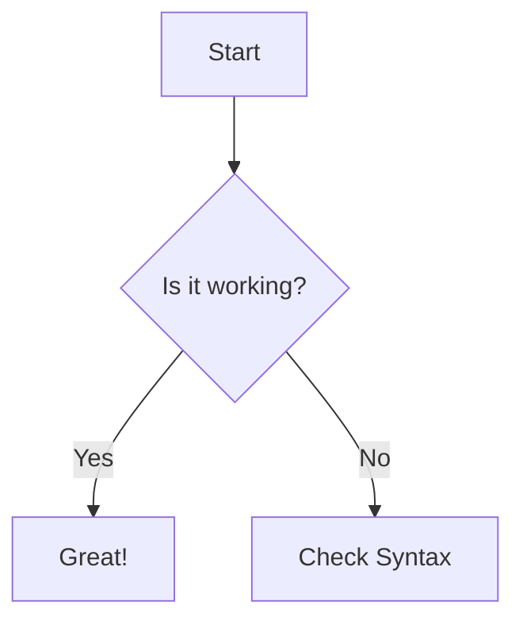

---
{"dg-publish":true,"permalink":"/0001-home/ethnic-texan-home/","tags":["gardenEntry"],"created":"2025-12-22T10:55:34.953-06:00","updated":"2025-12-23T14:42:59.248-06:00"}
---

# Welcome To Ethnic Texan Home!
---
A digital archive of the people of Texas, honoring those who came before us.

# Family Lines
---

## [[0002 - Family Lines/Garza Line/Juana Garza Line - Wife of Jesus Herrera\|Juana Garza Line - Wife of Jesus Herrera]]
## [[0002 - Family Lines/Herrera Line/Herrera Family Line\|Herrera Family Line]]
## [[0002 - Family Lines/Ximenez Line/Ximenez Family Line\|Ximenez Family Line]]

**test Mermaid map**

**Test inline trnclustion**

<a class="markdown-embed-link" href="/0002-family-lines/garza-line/juana-garza-line-wife-of-jesus-herrera/#1870" aria-label="Open link"><svg xmlns="http://www.w3.org/2000/svg" width="24" height="24" viewBox="0 0 24 24" fill="none" stroke="currentColor" stroke-width="2" stroke-linecap="round" stroke-linejoin="round" class="svg-icon lucide-link"><path d="M10 13a5 5 0 0 0 7.54.54l3-3a5 5 0 0 0-7.07-7.07l-1.72 1.71"></path><path d="M14 11a5 5 0 0 0-7.54-.54l-3 3a5 5 0 0 0 7.07 7.07l1.71-1.71"></path></svg></a>

## 1870

###  february 1 
Apolnar Garza (Daughter) is born 

**Embed Map Test**

<iframe src="https://www.google.com/maps/embed?pb=!1m18!1m12!1m3!1d2427232.069997886!2d-101.80827034842926!3d27.10896676899604!2m3!1f0!2f0!3f0!3m2!1i1024!2i768!4f13.1!3m3!1m2!1s0x868872bda68e1e29%3A0x64009ad714cd7a39!2sCoahuila%2C%20Mexico!5e0!3m2!1sen!2sus!4v1766522152123!5m2!1sen!2sus" width="600" height="600" style="border:0;" allowfullscreen="" loading="lazy" referrerpolicy="no-referrer-when-downgrade"></iframe>

**Link cards **

    

        <h4 style="margin:0;"><a href="https://texashistory.unt.edu/">Texas History Portal</a></h4>
        
Gateway to rare, historical, and primary source materials.

    

# Help Preserve Our History
---

Family history is a collaborative effort, and I would love to hear from you. Whether you have a cherished family photo, a story passed down through generations, or have spotted a date that needs correcting, your input helps this tree grow.

**How to contribute:** Please send your stories, photos, or feedback to: **EthnicTexan@gmail.com**

> **A quick note:** This site is a solo passion project. I personally review every email I receive, but it may take me a little time to respond. Thank you for your patience!

# Privacy 
---

Please visit our [[8000 - Privacy/Privacy Policy\|Privacy Policy]] to find out more about how we protect your data. 

